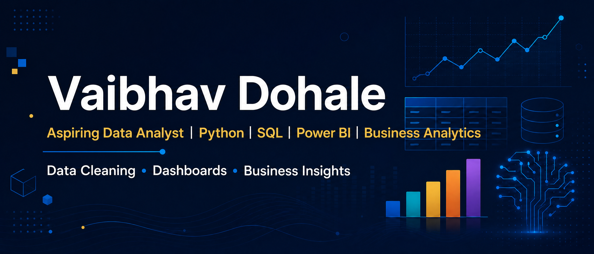

# Hi, I'm Vaibhav Dohale

### Aspiring Data Scientist | Continuous Learner | On the Path to Becoming a Data Analyst

I’m an aspiring data professional building my skills in data analysis, programming, visualization, and AI-powered productivity. I enjoy learning by creating practical projects and using technology to automate repetitive work.

## Skills

- Python
- SQL
- Power BI
- Data Analysis and Visualization
- Artificial Intelligence and Workflow Automation

## Tech Stack & Tools

  
  
  
  
  
  
  

## AI Tools

ChatGPT • Claude • Manus

## Featured Project

### Cupid Detective
A Python-based interactive detective game that turns relationship-themed answers into a playful compatibility investigation. Built as an entertainment project, it demonstrates practical software development, data processing, reporting, and testing skills.

**Highlights:**

- Rule-based scoring, compatibility ratings, risk analysis, badges, and suggestions.
- Persistent case history with browsing, searching, and statistics dashboards.
- Text and PDF report generation for every investigation.
- Validated menu input and automated regression and integration tests.

**Built with:** Python, ReportLab, file-based data storage, and automated testing.

[View the Cupid Detective repository](https://github.com/vaibhavdohale759-oss/Cupid-Detective)

### Sales Data Analysis with Python
A reproducible retail analytics project using Pandas, Matplotlib, and Seaborn to clean transaction data, analyze revenue trends, compare countries and products, and produce business insights.

[View the Sales Data Analysis repository](https://github.com/vaibhavdohale759-oss/sales-data-analysis)

## Currently Learning

I’m currently strengthening my foundation in **Data Analytics**, **Statistics**, **Pandas**, and **Machine Learning** as I continue working toward a career as a data analyst and aspiring data scientist.

## Current Focus

I’m currently developing my skills in data analytics and working toward becoming a data analyst, while continuing to explore data science, AI, and workflow automation.

## GitHub Stats

  
  

## Open to Opportunities

I’m open to **internships**, **entry-level data analyst opportunities**, collaborations, and practical learning projects where I can apply my skills in Python, SQL, Power BI, data analysis, and AI-powered workflow automation.

## Connect

- GitHub: [@vaibhavdohale759-oss](https://github.com/vaibhavdohale759-oss)
- LinkedIn: [Vaibhav Dohale](https://www.linkedin.com/in/vaibhav-dohale-76a26b2aa/)
- Email: [vaibhav759dohale@gmail.com](mailto:vaibhav759dohale@gmail.com)
